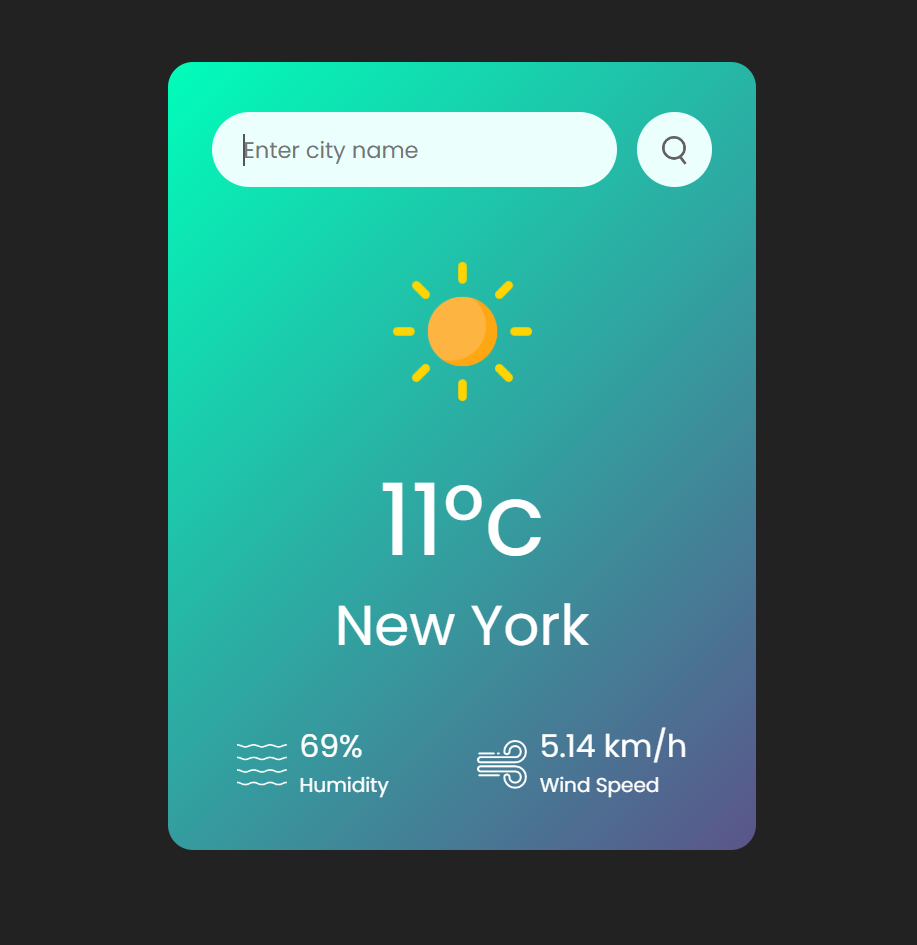

# Weatherly - Simple Weather App

Weatherly is a straightforward weather web application that allows users to check the current weather conditions for a specific city. It provides real-time data on temperature, humidity, wind speed, and weather description.

## Features

- **Current Weather Data:** Weatherly displays the current temperature, humidity, and wind speed for the selected city.
- **Dynamic Weather Icons:** It uses dynamic weather icons to represent the current weather conditions.
- **Error Handling:** In case of an invalid city name, it shows an error message.
- **Responsive Design:** Weatherly is designed to work on both desktop and mobile devices.

## Demo

You can check out a live demo of Weatherly [here](https://your-demo-url.com).

## How to Use

To use Weatherly, follow these simple steps:

1. Clone or download this repository.

2. Open the `index.html` file in a web browser.

3. Enter the name of the city for which you want to check the weather in the input field.

4. Click the search button or press Enter.

5. The application will fetch weather data from the OpenWeatherMap API and display it on the screen.

## Screenshots

## Technologies Used

- HTML
- CSS
- JavaScript

## Contributing

Feel free to contribute to this project. If you have any suggestions, bug reports, or feature requests, please open an issue or a pull request.

## Author

- Manoj M V
- GitHub: [Manoj-M-V](https://github.com/Manoj-M-V)

## Acknowledgments

- Weather data provided by [OpenWeatherMap](https://openweathermap.org/).

---

Enjoy using Weatherly! If you have any questions or need assistance, please don't hesitate to [contact us](mailto:manojvrao28@gmail.com).

